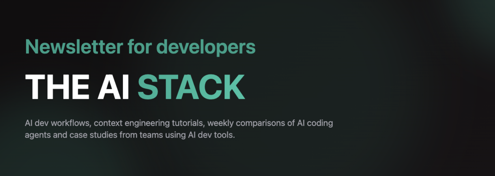

<a href="https://www.theaistack.dev/subscribe" target="_blank">The AI Stack Newsletter</a> – Free weekly updates on context engineering, ai dev workflows and Ai dev tool insights.

# MCPs for Developers

This repo hosts an open list of the most useful MCP servers for developers, curated and maintained by my [The AI Stack](https://www.theaistack.dev) newsletter.

- **Notion (Recommended for Browsing):**
  - The Notion version is always the **most up-to-date, filterable, and interactive** experience. And I keep updating stuff there and give the updates in my newsletter.
  - [Access to Notion database here](https://www.notion.so/MCP-resources-by-the-The-AI-Stack-243b157908ae80148480da114cdadb41)

- **Remote Support**: Requires API keys/tokens
- **Local Only**: Runs on your machine  
- **Remote + OAuth**: Requires OAuth authentication
- **Remote (No OAuth)**: No authentication needed

## 🔌 MCP Servers

A comprehensive list of Model Context Protocol (MCP) servers to supercharge your AI development workflow.

| Name | Category | Connection Type | ⭐ Stars | Description |
|------|----------|----------------|-------|-------------|
| [Apify MCP Server](https://docs.apify.com/platform/integrations/mcp) | Data Sources | Remote Support | - | AI/agent integration for web scraping and workflow automation on Apify Actors. |
| [Brave Search MCP](https://github.com/brave/brave-search-mcp-server) | Data Sources | Remote + OAuth | 29 | Favored by privacy-focused users; highlighted for real-time, unbiased results for LLMs. Positive sentiment for Google... |
| [browser-use-mcp-server](https://github.com/Saik0s/mcp-browser-use) | Browser | Remote Support | 771 | Controls browser sessions for automated web interactions and workflow integration. |
| [BrowserStack MCP](https://github.com/browserstack/mcp-server) | Development Tools | Remote + OAuth | 81 | Official integration with BrowserStack Test Platform—well received for VS Code, Claude, and test automation with LLMs. |
| [Clear Thought MCP Server](https://github.com/waldzellai/waldzell-mcp/tree/main/servers/server-clear-thought) | Development Tools | Remote Support | 146 | Known for clean, transparent reasoning in LLM/agent workflows. Positive feedback in AI/research communities for conte... |
| [Cloudflare MCP Server](https://github.com/cloudflare/mcp-server-cloudflare) | Development Tools | Remote + OAuth | 2.8k | Modern infrastructure/edge networking for AI agents—low latency, scalable, widely discussed by AI devs for production... |
| [Cloudflare Playwright MCP](https://github.com/cloudflare/playwright-mcp) | Development Tools | Remote Support | 101 | Celebrated for next-gen browser automation integrated with Cloudflare Workers. Enables LLMs (Claude, VS Code, AI Play... |
| [Context7 MCP Server](https://github.com/upstash/context7) | Development Tools | Remote Support | 22.5k | Real-time, version-specific dev docs. Lauded for improving LLM coding accuracy and developer context. |
| [Database Dynamo (PostgreSQL MCP Server)](https://github.com/crystaldba/postgres-mcp) | Databases | Remote + OAuth | 789 | Praised in dev and Claude communities for full-lifecycle support (dev, test, prod). Key features: health checks, safe... |
| [Docker MCP Server](https://github.com/QuantGeekDev/docker-mcp) | Development Tools | Local Only | 354 | Widely praised in the Claude, Cursor, and Smithery communities for seamless integration of Docker operations with Cla... |
| [DuckDuckGo MCP Server](https://github.com/nickclyde/duckduckgo-mcp-server) | Data Sources | Remote Support | 311 | Praised for empowering AIs (Claude, Cursor, etc.) with DuckDuckGo web search and advanced content fetching/parsing. F... |
| [Exa MCP Server](https://github.com/exa-labs/exa-mcp-server) | Data Sources | Remote Support | 2k | Highly recommended across AI/Claude, research, and devops forums as the "go-to" for real-time web, GitHub, and resear... |
| [Excel MCP Server](https://github.com/haris-musa/excel-mcp-server) | Data Sources | Remote Support | 1.8k | Critical in AI-for-productivity forums for full Excel manipulation (create, read, update, formula, pivots, charts) wi... |
| [Firecrawl MCP](https://github.com/mendableai/firecrawl-mcp-server) | Browser | Remote Support | - | Web crawler for browser automation/data mining—enables rich data extraction in agent contexts. |
| [GitHub MCP Server](https://github.com/github/github-mcp-server) | Development Tools | Remote + OAuth | 19.2k | Hugely popular for dev workflows. Strong positive mentions in Reddit and Hacker News communities for seamless repo in... |
| [iOS Simulator MCP Server](https://github.com/InditexTech/mcp-server-simulator-ios-idb) | Development Tools | Local Only | 214 | Enables natural language and API control of iOS simulators—strong buzz for UI automation and dev testing. |
| [MCP Atlassian](https://github.com/sooperset/mcp-atlassian) | Development Tools | Remote + OAuth | 2.6k | Universally praised for transforming Jira/Confluence automation and workflow. Seamless integration with Claude, Curso... |
| [MCP Chain of Thought](https://github.com/liorfranko/mcp-chain-of-thought) | Development Tools | Remote Support | 15 | Well-received in AI/dev/research communities for "agentic" project/task breakdowns, chain-of-thought reasoning, refle... |
| [MCP Server Chart (AntV)](https://github.com/antvis/mcp-server-chart) | Other | Remote Support | 2.2k | Celebrated in AI/dev groups for robust chart/vis generation (25+ charts), direct use in Claude, Dify, VS Code, etc. U... |
| [MCPControl](https://github.com/claude-did-this/MCPControl) | Development Tools | Remote Support | 178 | Rapidly rising for Windows desktop automation. Strong reviews for LLM/Claude integration and extensibility. |
| [MCPControl](https://github.com/claude-did-this/MCPControl) | Development Tools | Remote Support | 178 | Fast-rising favorite for Windows automation with Claude/LLMs. Praised for granular desktop control (mouse/keyboard), ... |
| [MCPQL - SQL Server MCP Server](https://github.com/RichardHan/mssql_mcp_server) | Databases | Remote Support | 189 | Brings SQL Server database management and analysis to AI workflows via MCP protocol. |
| [mem0](https://github.com/mem0ai/mem0) | Memory | Local Only | 37.2k | Widely regarded as a state-of-the-art memory backend for AI agents and LLMs. Lauded on Reddit and social forums for f... |
| [Notion MCP Server](https://github.com/makenotion/notion-mcp-server) | Data Sources | Remote + OAuth | 2.8k | Lets AI tools access and update Notion workspaces. Favored for workflow enhancements and AI-driven productivity. |
| [Office Word MCP Server](https://github.com/GongRzhe/Office-Word-MCP-Server) | Data Sources | Local Only | 436 | Highly valued for AI-powered Word doc management—advanced create/edit/merge, rich formatting, PDF export. Community u... |
| [Playwright MCP Server](https://github.com/microsoft/playwright-mcp) | Development Tools | Remote Support | 15.6k | Loved by developers working on browser automation and data scraping. Social communities applaud rapid implementation ... |
| [Puppeteer MCP Server](https://github.com/AgentDeskAI/browser-tools-mcp) | Browser | Remote Support | - | Browser automation via Puppeteer, with dev tools/CLI. Well-known for scriptability in agent workflows. |
| [Reddit MCP Server](https://github.com/Arindam200/reddit-mcp) | Social | Remote Support | 151 | Strong support on r/claudeAI and r/MCPservers for real-time subreddit analysis, engagement tracking, and overall ease... |
| [Redis MCP Server](https://github.com/redis/mcp-redis) | Social | Local Only | 166 | Official agentic-Redis server: supports full Redis data ops (lists, sets, vectors, search, JSON, streams). OpenAI, Cl... |
| [Sequential Thinking MCP](https://github.com/modelcontextprotocol/servers/tree/main/src/sequentialthinking) | Other | Local Only | - | Praised for dynamic problem-solving and structured thinking steps. Mentioned in agent/AI productivity discussions as ... |
| [Slack MCP Server](https://github.com/korotovsky/slack-mcp-server) | Social | Remote + OAuth | 369 | Highly discussed for team automation. Seen as 'game-changer' for integrating Claude/AI with workplace chat tools. |
| [Stagehand](https://github.com/browserbase/stagehand) | Browser | Remote Support | 14 | Highly praised as a next-gen AI browser automation framework. Community loves choice of code vs. natural language, Pl... |
| [Supabase MCP Server](https://github.com/supabase-community/supabase-mcp) | Databases | Remote Support | 1.9k | Enables seamless AI integration with Supabase for improved database and workflow automation. |
| [supermemory-mcp](https://github.com/supermemoryai/supermemory-mcp) | Memory | Remote (No OAuth) | 1.1k | Praised on Reddit and by ChatGPT/Claude communities for its zero login, instant MCP setup, and seamless use “anywhere... |
| [TaskManager MCP](https://github.com/kazuph/mcp-taskmanager) | Development Tools | Local Only | 172k | Lauded in Claude-project and Cursor subreddits for automating workflow queues, especially for integrating repetitive ... |
| [Tavily MCP](https://github.com/tavily-ai/tavily-mcp) | Data Sources | Remote Support | 606 | High-quality, domain-aware information retrieval. Strong adoption by researchers and academic users for precise data ... |
| [Terminal Controller MCP](https://github.com/GongRzhe/terminal-controller-mcp) | Development Tools | Local Only | 70 | Secure, cross-platform terminal and filesystem control from AI/LLMs. Strong praise for natural language command execu... |
| [Time MCP Server](https://github.com/yokingma/time-mcp) | Other | Local Only | 39 | Fills a crucial gap: "brings time awareness to LLMs." Popular among Claude/Cursor users for giving AIs access to curr... |
| [WhatsApp MCP Server](https://github.com/lharries/whatsapp-mcp) | Social | Remote Support | 4.5k | Enables powerful message management and automation for WhatsApp via AI; discussed in both dev and productivity circle... |

## 📋 MCP Registries

Discover and explore MCP servers through these curated registries and directories.

| Registry | Key Focus | Scale | Notes |
|----------|-----------|-------|-------|
| [Awesome MCP](https://github.com/punkpeye/awesome-mcp-servers) | Community, open source | 500+ servers | GitHub curated, remote & local endpoints |
| [Composio](https://mcp.composio.dev/) | SSE-based, frameworks | 100s | Easy AI/agent kit integration |
| [Cursor MCP Directory](https://cursor.directory/mcp) | Cursor/Claude integration focus | 100s | Endpoints compatible with cursor/Claude |
| [Glama](https://glama.ai/mcp/servers?attributes=category%3Abrowser-automation) | Quality/curation focus | Fewer (filtered) | Only stable, production MCPs |
| [gumloop](https://www.gumloop.com/mcp) | OSS hosted endpoints | N/A | Plug-and-play, frictionless for devs |
| [MCP Hub (CAMEL-AI)](https://mcp.camel-ai.org/) | LangChain, VS Code integrations | 100+ | Official MCPs and integrations |
| [MCP Registry Registry](https://mastra.ai/mcp-registry-registry) | Meta-registry listing all registries | Varies | Lists and links to all known MCP registries |
| [mcp.run](https://www.mcp.run/registry) | Business MCP apps | 100s | API/automation driven |
| [Official MCP Servers](https://github.com/modelcontextprotocol/servers) | Official reference implementations | 50+ official servers | Official reference implementations and canonical servers |
| [OpenTools](https://opentools.com/registry) | Dev-oriented, multi-language | 100s | REST API, Python/TypeScript SDKs |
| [PulseMCP](https://www.pulsemcp.com/servers) | Hosted MCP tools/apps | 5,000+ servers | Curated, production focus, updated daily |
| [Raycast Registry](https://www.raycast.com/raycast/model-context-protocol-registry) | Meta-registry | Varies | Works across agent clients, official/community |
| [Smithery](https://smithery.ai/) | General-purpose, very broad | 2,000+ servers | CLI/API support, open standard |

## Stay in Touch
- <a href="https://www.theaistack.dev/subscribe" target="_blank">The AI Stack Newsletter</a> – context engineering, ai dev workflows and Ai dev tool insights weekly.
- Feedback & suggestions always welcome!